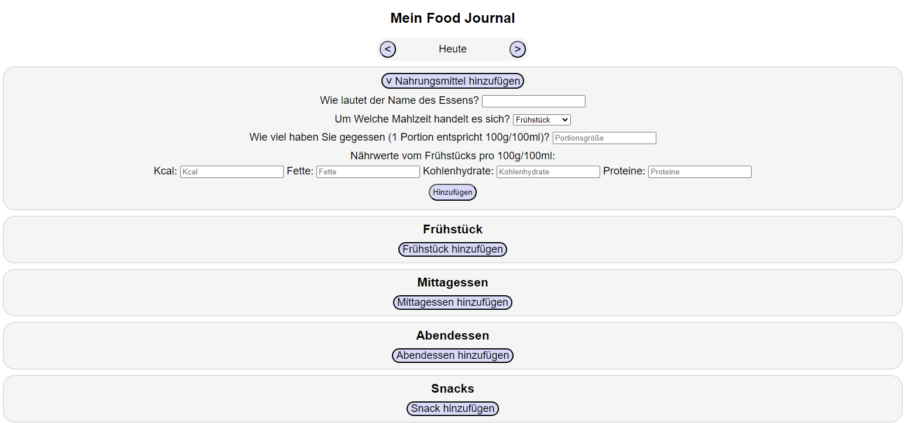

# FoodJournal Refactoring
Es wurden Teile im Code des Food Journals refaktoriert, der für die Erfassung von Nahrungsmitteln verantwortlich ist. Dies umfasst die Umstrukturierung des HTML-Codes und die Verbesserung der Benennung von Variablen und Funktionen.

Hierbei bekommt die verschiedenen Listen, wo die Nahrungsmittel eingetragen werden können, nicht mehr alle ihre eigenen und gleichzeitig aber auch identischen Felder um das Essen über einen bestimmten Tag hinweg eintragen zu können.

Stattdessen werden diese Felder einmal angelegt und zusätzlich eine Auswahl hinzugefügt, wo ausgesucht werden kann in welche Liste das Nahrungsmittel hinzugefügt werden soll.

## Angewendete Clean Code Prinzipien:

### Aussagekräftige Variablennamen
Im refaktorierten Code wurden aussagekräftige Variablennamen verwendet, um die Lesbarkeit zu verbessern und die Absicht hinter den Variablen klarer zu machen. Beispielsweise wurden Variablennamen wie "foodInputContainer" statt "inputContainer" verwendet, um den Zweck der Elemente im HTML-Code zu beschreiben.

### Single Responsibility Principle (SRP)
Die Funktionen wurden aufgeteilt, um sicherzustellen, dass jede Funktion eine klare und einzelne Verantwortung hat. Beispielsweise wurde die Funktion "addFood()" geschaffen, um ein Nahrungsmittel hinzuzufügen, anstatt separate Funktionen für jedes Nahrungsmittel zu haben.

### Vermeidung von Duplikation
Gemeinsame Strukturen im HTML-Code wurden durch Verwendung von wiederholbaren Klassen und durch die Zusammenfassung von ähnlichem Verhalten in JavaScript-Funktionen reduziert. Hierdurch konnte nicht nur HTML-Code, sondern auch JavaScript-Code reduziert werden.

### Lesbarkeit und Übersichtlichkeit
Der Code wurde umgestaltet, um die Lesbarkeit und Übersichtlichkeit zu verbessern. Dies wurde durch die Gruppierung von ähnlichem Code, die Verwendung von kommentierenden Elementen und das Entfernen von unnötigem Code erreicht.

## Zusammenfassung
Die Refaktorisierung des Codes für das Food Journal zielt darauf ab, die Lesbarkeit, Wartbarkeit und Erweiterbarkeit des Codes zu verbessern. Durch die Anwendung von Clean Code Prinzipien wie aussagekräftigen Variablennamen, SRP, Vermeidung von Duplikation und Verbesserung der Lesbarkeit wurde der Code klarer strukturiert und leichter zu verstehen. Dies trägt dazu bei, die Qualität des Codes zu verbessern und zukünftige Änderungen oder Erweiterungen des Projekts zu erleichtern.